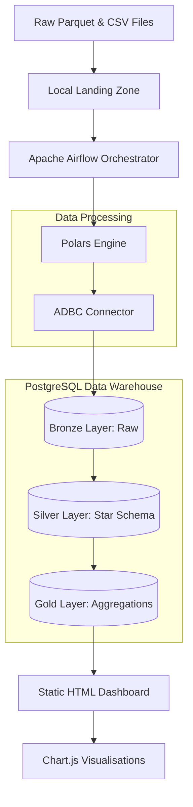
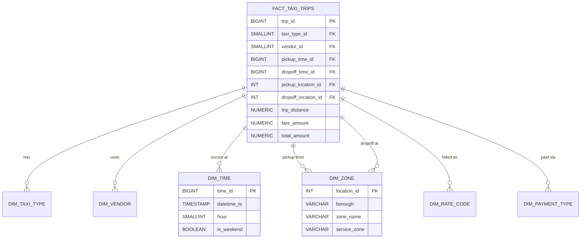
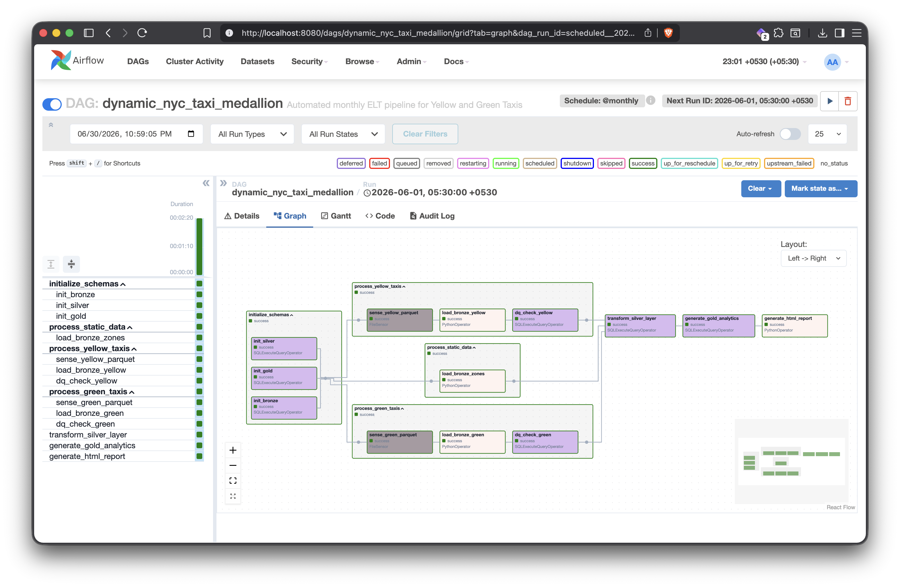
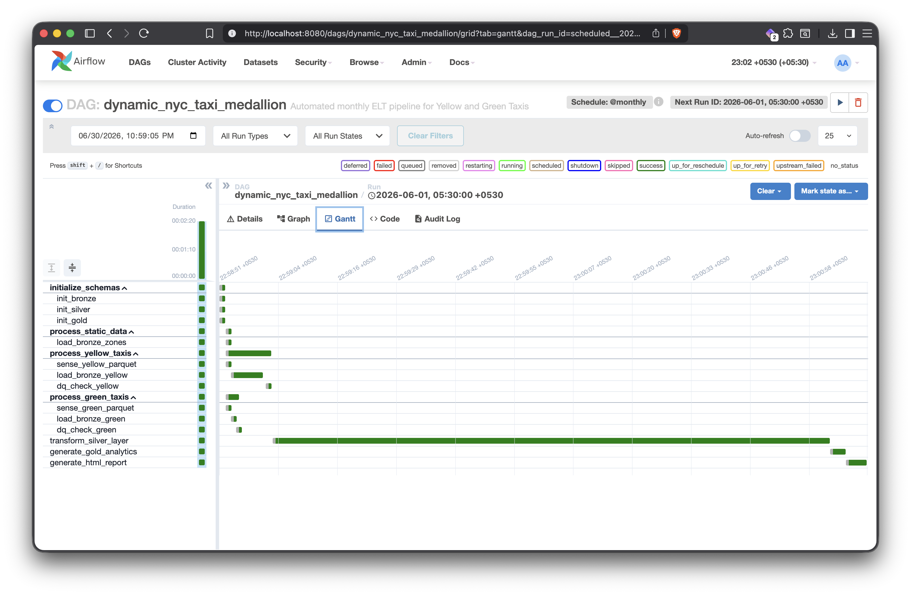
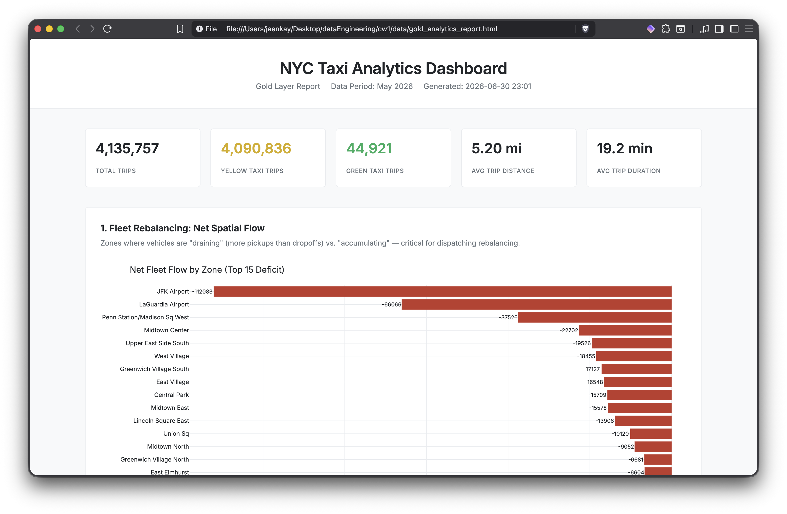

# NYC Taxi Data Medallion Pipeline


An automated, end to end Data Engineering ETL pipeline that processes high volume NYC Taxi trip records, transforms them into a business ready Star Schema, and generates a static HTML analytics dashboard.

This project goes beyond simple scripting. It combines:

* Medallion data architecture (Bronze, Silver, Gold),
* Polars and ADBC for ultra fast bulk ingestion,
* Apache Airflow for advanced task orchestration,
* PostgreSQL for relational data warehousing,
* Dimensional modeling using a Star Schema,
* Data quality checks and idempotency,
* and a Self contained analytics dashboard built with Chart.js.

---

## What This Project Does

The NYC Taxi Pipeline ingests massive monthly datasets of Yellow and Green taxi trips, alongside static zone lookup data, and transforms them into actionable business intelligence.

The system calculates and identifies:

* Net fleet flow to find areas where taxis are accumulating or draining,
* Congestion fee revenue and its impact across different boroughs,
* Average network speeds and trip volumes by hour of day,
* Airport market share between Yellow and Green taxis,
* Tipping elasticity to see how tip percentages change with trip distance,
* and a Overall summary statistics for fleet performance.

---

## Features

* **High Performance Ingestion:** Uses Polars and Arrow Database Connectivity (ADBC) instead of Pandas to load millions of records directly into PostgreSQL with minimal memory overhead.
* **Medallion Architecture:** Strictly follows the Bronze (raw), Silver (cleansed and normalized), and Gold (aggregated) design pattern.
* **Dimensional Modeling:** Structures data into a central Fact Table surrounded by heavily indexed Dimension Tables to optimize analytical queries.
* **Advanced Airflow Orchestration:** Utilizes parallel processing streams, FileSensors (poke mode), TaskGroups, and dynamic Jinja templating.
* **Idempotency and Data Quality:** Safely overwrites existing data on reruns without duplication and filters out bad records automatically.
* **Complex SQL Analytics:** Employs window functions, conditional logic, and aggregations to answer real world business questions.
* **Static HTML Dashboard:** Automatically generates a production ready, standalone HTML report powered by Chart.js, requiring no active web server to view.
* **Fully Containerized:** Runs entirely within Docker for seamless local deployment.

---

## Benefits

* Converts raw, messy parquet files into highly structured, queryable data.
* Demonstrates how to handle out of memory data efficiently using Polars.
* Shows how to orchestrate complex dependencies safely with Apache Airflow.
* Connects raw transactional data to high level strategic business insights.
* Provides a scalable foundation that can easily be adapted for cloud data warehouses like Snowflake or BigQuery.
* Demonstrates practical use of Data Engineering, Data Analytics, and Software Engineering in one project.

---

## System Architecture



---

## Tech Stack

### Core Platform

* Docker
* Docker Compose
* Apache Airflow

### Data Processing and Storage

* Polars (Data manipulation)
* ADBC (Fast database writing)
* PostgreSQL (Data Warehouse)
* Parquet and CSV (Source formats)

### Analytics and Frontend

* Standard SQL (Transformations and Aggregations)
* HTML5 and CSS3
* JavaScript
* Chart.js (Data Visualization)

---

## Why This Project Is Significant

This project combines **Data Engineering**, **Data Architecture**, and **Analytics Engineering** in a production oriented system.

### Data Engineering

* Designed and implemented a containerized Airflow environment.
* Built parallel data ingestion pipelines capable of handling millions of rows.
* Handled schema evolution and data type mapping between Parquet and PostgreSQL.
* Engineered a pipeline that relies on FileSensors to trigger automatically when data arrives.
* Ensured complete idempotency so the pipeline can be rerun safely.

### Data Architecture

* Implemented a strict Medallion Architecture (Bronze to Silver to Gold).
* Designed a Star Schema dimensional model with Fact and Dimension tables.
* Enforced primary and foreign key constraints for data integrity.
* Created strategic indexes to heavily optimize analytical JOIN operations.

### Analytics Engineering

* Wrote complex SQL transformations to clean and aggregate data.
* Built diagnostic analytics for fleet flow, congestion fees, and traffic speeds.
* Designed a lightweight, serverless HTML dashboard to present findings.
* Removed heavy dependencies by replacing Plotly with CDN hosted Chart.js.
* Formatted the final output for business stakeholders with a clean, Apple inspired minimalist UI.

---

## Data Model



*(Note: Diagram is simplified. The actual schema contains additional dimensions and metrics).*

---

## Analytics Techniques Used

| Analytics Type | Current Use | Techniques |
| :--- | :--- | :--- |
| Descriptive Analytics | Shows overall trip volumes and revenue | counts, sums, basic aggregations, summary statistics |
| Diagnostic Analytics | Explains traffic patterns and tipping behavior | time series analysis, data bucketing, percentage calculations |
| Spatial Analytics | Identifies supply and demand imbalances | net fleet flow calculations, pickup vs dropoff comparisons |
| Visualization | Presents insights to stakeholders | grouped bar charts, dual axis charts, line graphs |

---

## Dashboard Metrics

The generated analytics dashboard provides business ready insights, including:

* Breakdown of Yellow vs Green taxi usage
* Total trips
* Average trip distance and duration
* Top 15 zones with the highest fleet deficit (more pickups than dropoffs)
* Congestion fee revenue segmented by borough
* Average network speed comparing weekdays and weekends
* Airport corridor market share
* Tipping elasticity based on trip distance

---

## Demonstration

Below are screenshots demonstrating the running Airflow pipeline and the Analytics Dashboard.







---

## Repository Structure

```text
dags/
    pipeline.py                     # Main Airflow DAG orchestration
    generate_report.py              # Gold layer analytics and HTML generation
    sql/
      init_bronze_schema.sql        # Raw table definitions
      init_silver_schema.sql        # Star schema definitions
      silver_transformations.sql    # Cleaning and normalization logic    
data/
    gold_analytics_report.html      # Generated HTML Report
    landing/                        # Source directory for Parquet and CSV files
screenshots/                        # Demonstration Screenshots
docker-compose.yaml                 # Infrastructure Definition
README.md                           # Project Documentation
report.pdf                          # Technical Report
requirements.txt                    # Python Dependencies
```

---

## Quick Start

### Prerequisites

* Docker and Docker Compose installed.
* At least 4GB of RAM allocated to Docker.
* Raw NYC Taxi Parquet files and `taxi_zone_lookup.csv` placed in the `data/landing/` directory.

### Initialize the Environment

```bash
docker-compose up airflow-init
```
*(Wait for this process to exit with code 0).*

### Start the Cluster

```bash
docker-compose up -d
```

### Access Airflow

1. Open `http://localhost:8080` in your browser.
2. Log in with Username: `airflow` and Password: `airflow`.
3. Unpause the `dynamic_nyc_taxi_medallion` DAG.
4. Trigger the DAG manually to start the data pipeline.

### View the Dashboard

Once the DAG completes successfully, open the generated HTML report:
```text
data/gold_analytics_report.html
```

### Shut Down

```bash
docker-compose down
```

---

## Project Highlights

This project demonstrates:

* Modern data engineering practices
* Containerized infrastructure management
* Robust workflow orchestration
* Fast, memory efficient data processing
* Rigorous dimensional modeling
* Advanced SQL transformations
* Full stack data capabilities from raw files to final frontend visualization
* Clear documentation and code organization

It shows the ability to build not just a script, but a full **automated data platform** that supports business intelligence and strategic decision making.

<br><br>

---

Copyright © 2026 Janidu Kodithuwakku. All Rights Reserved.